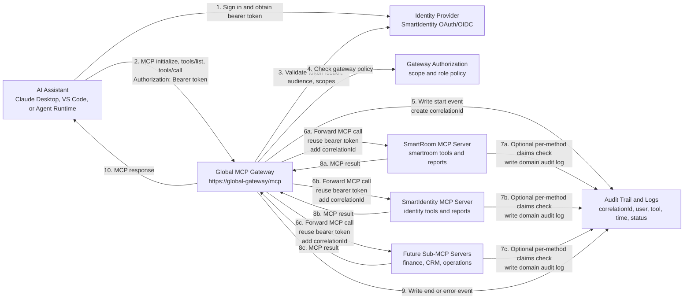

# Global Gateway MCP Architecture

## Purpose

This document explains the business architecture for a global MCP gateway that exposes AI assistant actions through one governed entry point, then routes approved requests to specialized sub-MCP servers such as SmartRoom and SmartIdentity.

The goal is to make AI assistant actions, including actions from Claude Desktop or other MCP clients, controlled, explainable, and auditable.

## Executive Summary

The global MCP gateway is the single public MCP endpoint for AI assistants. It authenticates the caller, applies high-level authorization, generates an audit `correlationId`, discovers available subserver tools, and forwards approved MCP calls to the correct sub-MCP server.

Sub-MCP servers own domain-specific capabilities:

- SmartRoom MCP owns smartroom reporting and smartroom-related business data.
- SmartIdentity MCP owns identity and user-related reporting.
- Future sub-MCP servers can be added without changing the assistant-facing gateway contract.

The gateway can reuse the original bearer token when calling sub-MCP servers, so downstream services can make their own authorization decisions from the same user or application identity.

## Presentation Diagram



## Authentication Flow

1. The AI assistant authenticates through SmartIdentity or another configured identity provider.
2. The assistant calls the global MCP gateway with `Authorization: Bearer <token>`.
3. The gateway validates:
   - Token issuer through the configured authority.
   - Token audience.
   - Required scope or role claims.
4. The gateway forwards approved subserver calls and can reuse the same bearer token when calling SmartRoom MCP, SmartIdentity MCP, or another sub-MCP server.
5. Each sub-MCP server can trust the gateway for coarse access control, or independently validate the bearer token for domain-specific access control.

In the current C# example, gateway authentication is configured in `src/MainGateway/appsettings.json`:

```json
{
  "Authentication": {
    "Authority": "https://identity-dev.smartexchange.com/server/",
    "Audience": "pkce",
    "Scopes": ["nextgenAPI", "crpProfilerAPI"]
  }
}
```

In `Development`, the example keeps `/mcp` and `/relay/*` open for local tools. Outside `Development`, the gateway requires the configured JWT authorization policy.

## Bearer Token Reuse To Sub-MCP Servers

The gateway relay path forwards the inbound `Authorization` header to the selected sub-MCP server. This allows the subserver to make decisions using the same identity context that was presented to the gateway.

Business benefit:

- The user or application identity stays visible end to end.
- Subservers do not need a separate assistant credential model.
- Auditors can connect the assistant request, gateway decision, and domain server action.
- A subserver can reject a call even if the gateway allowed access at a broader level.

## Audit Trail And Explainability

Every AI assistant action should be explainable after the fact. The gateway generates one `correlationId` for each tool call and passes it to sub-MCP servers as a tool argument.

Recommended audit fields:

- `correlationId`: one ID linking gateway and subserver logs.
- `timestampUtc`: when the action started, ended, or failed.
- `assistantClient`: Claude Desktop, VS Code, internal agent, or service name.
- `userId` or `clientId`: identity from the validated token.
- `tenantId` or organization ID if available.
- `mcpServer`: gateway, SmartRoom MCP, SmartIdentity MCP, or another subserver.
- `toolName`: requested MCP method or tool.
- `argumentsHash`: hash of sensitive inputs instead of raw values where needed.
- `authorizationDecision`: allowed or denied.
- `status`: start, end, or error.
- `errorCode` and `errorMessage` for failures.

Business benefit:

- Stakeholders can understand what the assistant did.
- Security and compliance teams can trace who requested an action and which system executed it.
- Investigation teams can join logs across the gateway and domain services using `correlationId`.
- Sensitive data can be protected while still preserving accountability.

## Authorization Options

Authorization can be implemented at two levels. Most production systems should use both.

### Gateway-Level Authorization

The gateway is the central control point. It can decide which MCP servers and methods are visible or callable based on claims.

Examples:

- Users with `scope=nextgenAPI` can call SmartRoom tools.
- Users with `scope=crpProfilerAPI` can call SmartIdentity tools.
- A gateway policy hides or blocks high-risk methods from general assistant clients.
- A tenant policy prevents cross-tenant calls before they reach a subserver.

Gateway-level authorization is best for:

- Central governance.
- Consistent assistant access policy.
- Reducing exposure of tools in `tools/list`.
- Fast blocking of risky methods.

### Sub-MCP Server Authorization

Each sub-MCP server can also validate claims and roles for its own methods.

Examples:

- SmartIdentity requires `role=Identity.Report.Reader` for identity reporting.
- SmartRoom requires `role=SmartRoom.Admin` for administrative operations.
- A method checks that the user's organization claim matches the requested smartroom.
- A subserver denies access to sensitive fields even when the gateway allows the general tool.

Subserver-level authorization is best for:

- Domain-specific rules.
- Method-level access control.
- Data-level security.
- Defense in depth.

## Recommended Business Architecture

Use the gateway as the public MCP boundary and policy enforcement point. Use sub-MCP servers for domain ownership and detailed authorization.

Recommended pattern:

1. Authenticate every assistant request at the gateway.
2. Validate issuer, audience, scope, and role claims.
3. Generate a `correlationId` at the gateway for every `tools/call`.
4. Log gateway start, end, and error events.
5. Forward the bearer token and `correlationId` to the selected sub-MCP server.
6. Let the subserver apply domain claims checks where needed.
7. Log subserver start, end, and error events with the same `correlationId`.
8. Return structured JSON responses so assistant answers can be traced back to source actions.

## Example Tool Governance Matrix

| MCP Server | Method | Gateway Policy | Optional Subserver Policy | Audit Requirement |
| --- | --- | --- | --- | --- |
| SmartRoom | `get_smartrooms_data` | `scope=nextgenAPI` | `role=SmartRoom.Report.Reader` | Required |
| SmartIdentity | `get_report_data` | `scope=crpProfilerAPI` | `role=Identity.Report.Reader` | Required |
| Gateway | `gateway_get_configuration` | Gateway admin or operator claim | Not applicable | Required |
| Gateway | `gateway_add_configuration` | Gateway admin claim | Not applicable | Required |
| Gateway | `gateway_restart` | Gateway admin claim | Not applicable | Required |

## Stakeholder Takeaways

- The global MCP gateway gives the business one governed AI integration point.
- Sub-MCP servers keep ownership close to the systems and teams that understand the data.
- Bearer token reuse keeps identity and access decisions consistent across the call chain.
- `correlationId` makes AI assistant actions traceable across gateway and subserver logs.
- Authorization can be centralized at the gateway and strengthened with per-method claims checks in each sub-MCP server.
